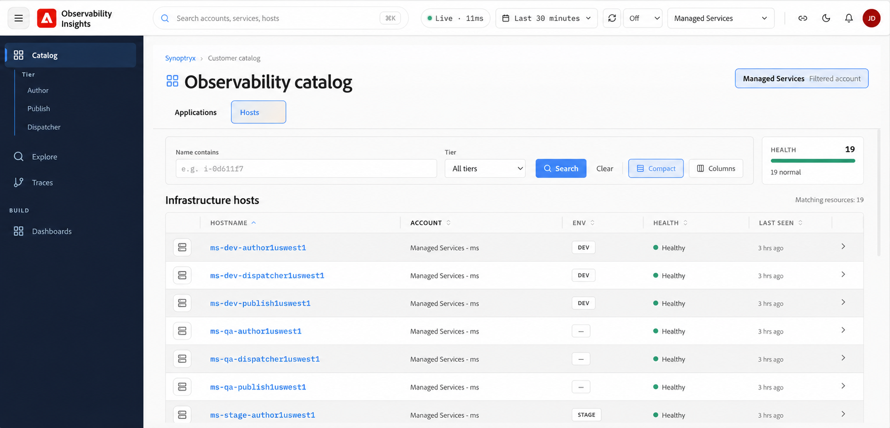

# Hôtes {#hosts}

Utilisez les hôtes dans Observability Insights pour surveiller l’intégrité, les performances et l’utilisation des ressources de l’infrastructure qui prend en charge vos applications et services. Utilisez les tableaux de bord de l’infrastructure pour identifier les problèmes liés à la capacité de l’hôte, à la pression du stockage, au débit réseau ou aux conflits de ressources du système d’exploitation.

## À quoi la surveillance de l’infrastructure vous aide à répondre {#what-infrastructure-monitoring-helps-you-answer}

La surveillance de l’infrastructure est particulièrement utile lorsque vous devez répondre à des questions telles que :

- Le ralentissement de l’application s’accompagne-t-il de CPU, de mémoire ou de pression d’E/S ?
- Un hôte se comporte-t-il différemment des autres dans le même environnement ?
- Les modèles de réseau ou de disque changent-ils au cours du même intervalle qu’un incident avec un client ?
- Les tendances d’utilisation du stockage indiquent-elles un problème de capacité à venir ?

## Accès aux hôtes d’infrastructure {#infrastructure-host-overview}

La surveillance des infrastructures offre une visibilité au niveau de l’hôte sur l’intégrité et les performances de l’infrastructure prenant en charge vos environnements AEM gérés. À partir du **catalogue d’observabilité**, vous pouvez parcourir les hôtes d’infrastructure et explorer un hôte individuel pour étudier le CPU, la mémoire, le réseau, le stockage et d’autres signaux au niveau du système.

## Accès aux hôtes d’infrastructure

Dans **Catalogue**, sélectionnez l’onglet **Hôtes** pour afficher l’infrastructure associée au compte sélectionné.

La vue **Hôtes d’infrastructure** fournit un inventaire des hôtes surveillés et comprend les éléments suivants :

- **Nom d&#39;hôte** — Nom de l&#39;hôte d&#39;infrastructure surveillé.
- **Compte** — Compte associé à l&#39;hôte.
- **Environnement** — Classification de l&#39;environnement, par exemple `DEV` ou `STAGE`.
- **Health** — État d&#39;intégrité actuel de l&#39;hôte.
- **Dernière diffusion** — Récemment la télémétrie a été reçue de l&#39;hôte.

## Flux d’investigation suggéré {#suggested-investigation-flow}

Pour la plupart des incidents, consultez le tableau de bord de l’hôte dans cet ordre :

1. Vérifiez l’utilisation du CPU, la charge moyenne et l’utilisation de la mémoire pour détecter une saturation évidente.
2. Vérifiez l’attente d’E/S CPU et le débit du disque si les temps de réponse augmentent sans un pic CPU correspondant.
3. Comparez le débit du réseau au trafic de l’application pour identifier les décalages liés à la charge.
4. Vérifiez l’utilisation du stockage et l’utilisation du disque au niveau du système de fichiers pour identifier le risque de capacité persistant.
5. Comparez plusieurs hôtes pour déterminer si le problème est localisé ou systémique.

## Éléments à vérifier en premier {#what-to-review-first}

- **CPU et mémoire** lorsqu&#39;une application apparaît lente ou instable sur une période plus étendue.
- **E/S de disque et E/S de CPU attendent** lorsque les requêtes se bloquent ou se mettent en file d’attente de manière inattendue.
- **E/S réseau** lorsque les caractéristiques du trafic changent ou que des dépendances en aval sont suspectées.
- **Utilisation du stockage** lorsque les incidents impliquent des échecs de déploiement, une pression d’indexation ou des problèmes de capacité à long terme.

Utilisez le champ **Nom contient** et le filtre **Niveau** pour limiter la liste des hôtes. Sélectionnez un nom d’hôte pour ouvrir ses détails de surveillance de l’infrastructure.

## Surveillance de l&#39;hôte

Après avoir sélectionné un hôte, la vue **Infrastructure** fournit des pages de surveillance dédiées pour cet hôte.

La navigation de l’hôte comprend :

- **Aperçu** — Vue d&#39;ensemble des principaux signaux relatifs à l&#39;état et à l&#39;utilisation de l&#39;infrastructure.
- **Mesures** — Mesures détaillées des performances de l&#39;hôte, notamment le CPU, la mémoire, la charge, les E/S de disque et le débit réseau.
- **Réseau** — Trafic réseau, activité de l&#39;interface et erreurs de transmission/réception.
- **Processus** — Surveillance au niveau du processus hôte.
- **Stockage** : utilisation du disque, E/S du disque et utilisation du système de fichiers.
- **Système** — Mesures des ressources du système principal telles que le CPU, la mémoire et la charge moyenne.

## Questions auxquelles il faut répondre pendant l&#39;enquête {#questions-to-answer}

- Le problème est-il isolé sur un hôte ou visible dans l’ensemble de l’environnement ?
- Les signaux du CPU, de la mémoire ou du disque sont-ils élevés dans la même fenêtre que l&#39;incident ?
- La croissance du stockage tend-elle vers un seuil qui pourrait affecter les opérations ?
- Les symptômes liés à l’infrastructure expliquent-ils le comportement de l’application ou apparaissent-ils uniquement comme un effet en aval ?

## Preuves à capturer lors de la réaffectation {#evidence-to-capture}

- Environnement et hôtes affectés
- Fenêtre temporelle de l’événement
- Captures d’écran de CPU, de mémoire, de disque et réseau
- Si l’anomalie est isolée ou systémique
- Symptômes d’application associés à partir d’APM
