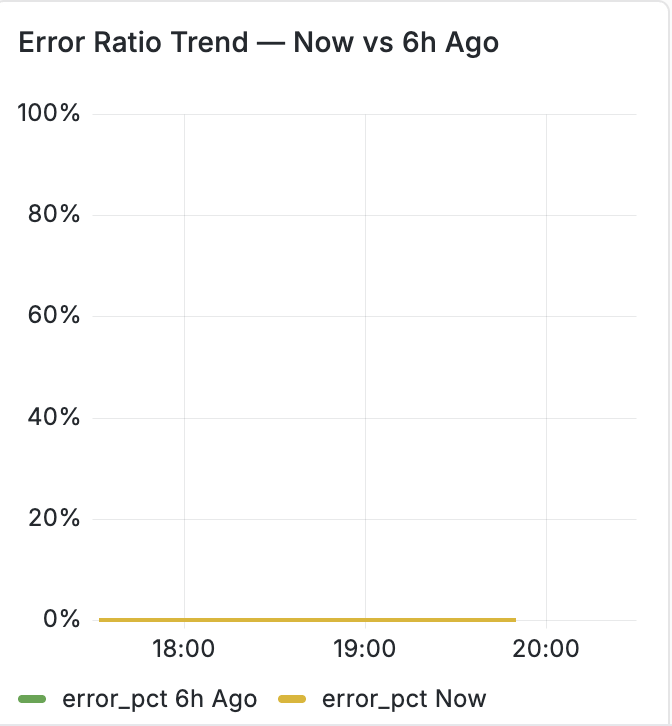

# Référence du tableau de bord APM {#apm-dashboard-reference}

Cette référence documente les principaux panneaux APM Observability Insights utilisés dans AEM Managed Services.

## Navigation dans les tableaux de bord


Le tableau de bord est organisé en sections extensibles qui regroupent les mesures de performances des applications associées. Le développement d’une section révèle un ou plusieurs graphiques associés à cette catégorie.

## Vue d’ensemble


### Description

La section **Présentation** présente des indicateurs clés de performance (KPI) de haut niveau qui résument l’état actuel de l’application surveillée.

Ces KPI fournissent un résumé d’un coup d’œil de l’activité de l’application, du débit, du succès de la requête et de l’expérience utilisateur globale.

### Mesures

#### Nombre total de demandes

Affiche le nombre total de demandes traitées par l’application au cours de la période sélectionnée.

**Mesure**

```
total_requests
```

**Unité**

- Décompte

#### Débit actuel

Affiche le taux actuel de traitement des demandes.

**Mesure**

```
throughput
```

**Unité**

- Demandes par seconde (req/s)

#### Taux d’erreur actuel

Affiche le pourcentage de demandes entraînant des erreurs.

**Mesure**

```
error_rate
```

**Unité**

- Pourcentage (%)

#### Score APDEX

Affiche l’indice de performance des applications (APDEX), une mesure normalisée de la satisfaction de l’utilisateur final basée sur les temps de réponse des applications.

Le seuil configuré est affiché dans le widget.

**Mesure**

```
apdex_score
```

**Unité**

- Score (0,0 - 1,0)

## Mesures ROUGES

La méthodologie RED mesure trois caractéristiques principales d&#39;une application :

- **Taux**
- **Erreurs**
- **Durée**

### Taux de demande


#### Description

Affiche le nombre de demandes d&#39;application reçues au fil du temps.

Ce graphique représente le débit des requêtes à l’aide d’une visualisation de série temporelle.

#### Mesure

```
req_min
```

#### Unité

- Demandes par minute (req/m)

#### Informations affichées

- Taux de requête de série temporelle
- Activité de requête historique
- Tendance du taux de demande
- Légende des mesures

### Taux d’erreurs


#### Description

Affiche le pourcentage de requêtes ayant entraîné des erreurs.

Le graphique compare les pourcentages d’erreur historiques et actuels.

#### Mesures

```
error_pct (now)
error_pct (1h ago)
```

#### Unité

- Pourcentage (%)

#### Informations affichées

- Pourcentage d’erreur actuel
- Comparaison historique
- Valeurs moyennes
- Tendance de série temporelle

### Durée de la demande


#### Description

Affiche la latence des requêtes sur plusieurs centiles de temps de réponse.

Le graphique trace simultanément les mesures de latence en centiles collectées pendant la période d’observation sélectionnée.

#### Mesures

```
P50
P75
P90
```

#### Unités

- Millisecondes (ms)
- Seconde (s)

Les unités sont automatiquement mises à l’échelle en fonction de la durée de réponse.

#### Statistiques affichées

Pour chaque centile :

- Moyenne
- Dernière
- Maximum

#### Définitions des centiles

| Mesure | Description |
| ------ | ----------------------------- |
| P50 | Temps de réponse du 50e centile |
| P75 | Temps de réponse du 75e centile |
| P90 | 90e centile du temps de réponse |

## Trafic

### Demandes par code d’état HTTP


#### Description

Affiche le débit des requêtes, regroupé par code de statut de réponse HTTP.

Chaque code d’état est tracé indépendamment au fil du temps.

#### Mesures

Les mesures courantes sont les suivantes :

```
req_s 200
req_s 300
req_s 400
req_s 500
```

en fonction de l’activité de l’application.

#### Unité

- Demandes par seconde (req/s)

#### Informations affichées

- Débit par statut HTTP
- Débit moyen
- Débit le plus récent
- Débit maximal
- Activité de série temporelle

### Taux de requêtes par point d’entrée


#### Description

Affiche les points d’entrée d’application à trafic le plus élevé classés par taux de requête.

Chaque point d’entrée s’affiche sous la forme d’une barre horizontale représentant le volume des requêtes.

#### Mesure

```
endpoint_request_rate
```

#### Unité

- Demandes par minute (req/m)

#### Informations affichées

- Chemin du point d’entrée
- Taux de demande
- Liste des points d’entrée avec classement
- Volume relatif des requêtes

## Latence et performances

### Temps de réponse : P95 contre 1 heure


#### Description

Affiche une comparaison du temps de réponse P95 actuel par rapport au temps de réponse P95 enregistré une heure plus tôt.

Les deux jeux de données s’affichent sur le même graphique de série temporelle.

#### Mesures

```
P95 (Current)
P95 (1 Hour Ago)
```

#### Unités

- Millisecondes (ms)
- Seconde (s)

#### Statistiques affichées

- Moyenne
- Dernière
- Maximum

### Score APDEX au fil du temps


#### Description

Affiche l&#39;indice de performance de l&#39;application sous la forme d&#39;une série temporelle continue.

Le graphique permet de visualiser les valeurs APDEX tout au long de l’intervalle de surveillance sélectionné.

#### Mesure

```
APDEX Score
```

#### Unité

- Score (0.0-1.0)

#### Statistiques affichées

- Moyenne
- Dernière
- Maximum

### Débit vs latence P95


#### Description

Affiche le débit des requêtes et la latence de réponse P95 sur la même chronologie.

Le graphique permet de visualiser simultanément le volume de trafic et la latence de réponse.

#### Mesures

```
Throughput
P95 Latency
```

#### Unités

| Mesure | Unité |
| ----------- | ------------ |
| Débit | Demandes/s |
| Latence P95 | Millisecondes |

#### Informations affichées

- Débit de la série temporelle
- Latence de série temporelle
- Comparaison des mesures doubles

## Détails des erreurs

### Taux d&#39;erreurs % par groupe de statuts


#### Description

Affiche les pourcentages d’erreur de l’application, regroupés par classe de réponse HTTP.

Des séries distinctes sont tracées pour chaque catégorie de réponse.

#### Mesures

Les groupes courants sont les suivants :

```
2xx
3xx
4xx
5xx
Combined Error Trend
```

en fonction du trafic observé.

#### Unité

- Pourcentage (%)

#### Informations affichées

- Pourcentage d’erreur par classe de réponse
- Pourcentage d’erreur moyen
- Tendance de série temporelle

### Tendance du taux d’erreurs - Maintenant par rapport à il y a 1 heure


#### Description

Affiche le taux d&#39;erreurs actuel de l&#39;application avec le taux d&#39;erreurs enregistré une heure plus tôt.

#### Mesures

```
Current Error Ratio
1 Hour Error Ratio
```

#### Unité

- Pourcentage (%)

#### Informations affichées

- Tendance actuelle
- Comparaison historique
- Visualisation de série temporelle

### Tendance du taux d’erreurs - Maintenant par rapport à il y a 6 heures



#### Description

Affiche le taux d’erreurs actuel de l’application avec le taux d’erreurs enregistré six heures plus tôt.

#### Mesures

```
Current Error Ratio
6 Hour Error Ratio
```

#### Unité

- Pourcentage (%)

#### Informations affichées

- Taux d’erreurs actuel
- Comparaison historique
- Visualisation de série temporelle

## Résumé des mesures du tableau de bord

| Tableau de bord | Mesures de Principal |
| -------------------------- | --------------------------------------------- |
| Vue d’ensemble | Nombre total de requêtes, débit, taux d’erreur, APDEX |
| Taux de demande | Demandes par minute |
| Taux d’erreurs | Pourcentage d’erreur |
| Durée de la demande | P50, P75, P90 Latence |
| Demandes par code d’état | Débit du statut HTTP |
| Taux de requêtes par point d’entrée | Volume de requêtes de point d’entrée |
| Comparaison du temps de réponse | P95 actuel et historique |
| Score APDEX | Indice de satisfaction des utilisateurs |
| Débit et latence | Débit des demandes et latence P95 |
| Taux d&#39;erreurs par groupe de statuts | Pourcentage d’erreur du groupe de statut HTTP |
| Tendances du taux d’erreurs | Ratio d’erreurs actuelles par rapport à historiques |
